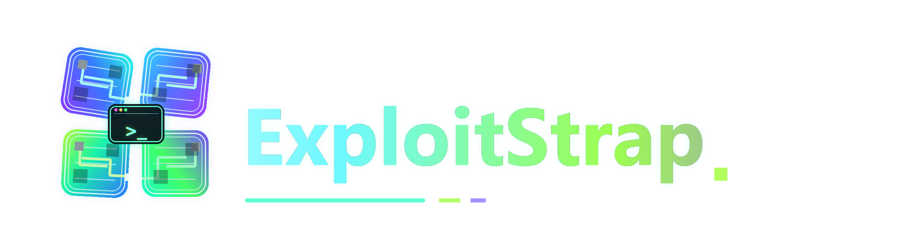

<!-- markdownlint-disable MD033 MD041 -->

> [!CAUTION]
> The only official place to download ExploitStrap is **this GitHub repository** — specifically the [Releases page](https://github.com/RealSlimShady2000/MrExLiveChannelForcer/releases). Any other website offering "ExploitStrap" downloads, or claiming to be us, is not controlled by us. Don't download from them.

<p align="center">
  
</p>

<p align="center">
  <a href="./LICENSE"></a>
  <a href="https://github.com/RealSlimShady2000/MrExLiveChannelForcer/actions/workflows/ci-release.yml"></a>
  <a href="https://github.com/RealSlimShady2000/MrExLiveChannelForcer/releases/latest"></a>
  <a href="https://github.com/RealSlimShady2000/MrExLiveChannelForcer/releases/latest"></a>
  <a href="https://discord.robloxscripts.com"></a>
  <a href="https://github.com/RealSlimShady2000/MrExLiveChannelForcer/stargazers"></a>
</p>

**The Roblox launcher built for executor and exploit users.**

A fork of [Bloxstrap](https://github.com/bloxstraplabs/bloxstrap) hardened against the things that usually break executors — surprise channel routing, version updates that ship before your tool catches up, and ban traces left on your machine — plus a load of quality-of-life extras.

If you found any bugs, please [open an issue here](https://github.com/RealSlimShady2000/MrExLiveChannelForcer/issues) or ask in our [Discord server](https://discord.robloxscripts.com).

> [!NOTE]
> ExploitStrap is an application for **Windows 10 and above**. It's built specifically for Roblox exploit / executor users — if you only play vanilla Roblox, you probably don't need most of what's here.

---

## At a glance

- ✅ **LIVE channel lock**
  - Forces Roblox onto production every launch. Fixes most "my executor broke after a Roblox update" cases on its own. If it doesn't, the downgrading tab handles it.
- ✅ **Versions Manager (multi-profile version switcher)**
  - Save a named profile per executor — "Solara", "Matrix Hub", "Latest LIVE", whatever you use. One click switches between them.
  - Each profile gets its own isolated Roblox folder so two executors can never trample each other's files.
  - Executor-tracked profiles auto-update from weao.xyz on every launch — when your executor pushes a new build, the profile follows automatically.
  - Optional "pick a profile when launching" prompt for users who want to choose on the fly.
  - "Set as install target" button on each tile so executor installers (Synapse Z, Wave) drop their files into the right profile's folder.
- ✅ **One-click downgrading**
  - Verify any historical Roblox build still exists on the CDN, with deployment timestamp and exact download size.
  - "Match your executor" dropdown driven by weao.xyz — pick your tool, the matching Roblox build gets pinned automatically.
- ✅ **BanAsync tab**
  - Clean Roblox traces, spoof your network MAC, randomize MachineGuid.
  - Optional toggle to wipe ONLY `roblox.com` / `rbxcdn.com` cookies from Chrome, Edge, Firefox, Brave, Opera, Vivaldi. Your other site cookies are never touched.
- ✅ **Multi-instance with auto window tiling**
  - Run several Roblox clients at the same time.
  - Auto-arrange every open client into a tidy grid on your primary monitor.
- ✅ **VIP server picker**
  - Pick a free shared VIP server before launch, straight from rbxservers.xyz.
- ✅ **Fast Flag editor (with up-to-date policy warning)**
  - Edit Roblox's Fast Flags via a config file before launch — the method Roblox staff has publicly confirmed is fine.
  - Banner spells out which tools to avoid (Voidstrap-style memory bypass) so you don't accidentally pick up something that gets your account banned.
- ✅ **Auto-update with a real progress bar**
  - Fires both when launching Roblox AND when opening the menu directly.
  - Determinate progress bar with byte-by-byte counter so you know it's actually working.
- ✅ **One-click diagnostic snapshot**
  - One button in Debug mode zips your logs, settings, environment, network adapters, running processes, health check, and a fresh GitHub probe into a single file for bug reports.
- ✅ **Privacy by default**
  - Roblox tracking cookies wiped before every launch.
  - Analytics permanently disabled (hardcoded off, no toggle).
- ✅ **Detailed error messages**
  - Failures show the actual reason (DNS, TLS, rate limit, disk full, partial download, etc.) instead of "something went wrong".

---

## How it compares

### vs vanilla / normal Bloxstrap

**Pros of ExploitStrap**

- ✅ **LIVE channel lock**
  - Vanilla leaves channel routing alone, so Roblox can A/B-route you onto a test build any time.
- ✅ **Versions Manager (multi-profile switcher)**
  - One profile per executor, instant switching, auto-updates from weao.xyz, isolated install folders. Not in vanilla.
- ✅ **Built-in BanAsync tab**
  - Trace cleanup, MAC spoofing, MachineGuid randomize, selective cookie cleaning — not in vanilla.
- ✅ **Match-your-executor dropdown**
  - Powered by weao.xyz — not in vanilla.
- ✅ **Per-version pin with CDN verification**
  - Vanilla has downgrading too, but the UX is less detailed (no deployment timestamp, no package-count preview).
- ✅ **Auto-update on menu open**
  - Vanilla only checks on Roblox launch — open the settings menu and you never see new releases.
- ✅ **Diagnostic-snapshot zip for bug reports**
  - Not in vanilla.
- ✅ **Up-to-date Fast Flag policy warning**
  - The Editor banner spells out which tools are bannable (Voidstrap-style memory bypass) so you don't end up using one by accident.
- ✅ **Analytics permanently off**
  - Hardcoded, no toggle.

**Cons of ExploitStrap**

- Smaller user base, less battle-tested than vanilla / normal Bloxstrap.
- Releases are unsigned, so Windows SmartScreen warns on first run.
- Stripped some of vanilla's polish (custom translator credits, broader theming options) to keep the surface focused.
- Built specifically for exploit / executor users — if you only play vanilla Roblox, you don't need most of this.

### vs Fishstrap (another popular Bloxstrap fork)

**Pros of ExploitStrap**

- ✅ **Exploit-first focus**
  - Channel lock, Versions Manager (one profile per executor), and executor version matching are the headline features.
- ✅ **Versions Manager**
  - Profile-per-executor switching with isolated install folders and weao.xyz auto-update. Fishstrap doesn't have an equivalent.
- ✅ **BanAsync tab**
  - Trace cleanup, MAC spoofing, MachineGuid randomize, and selective Roblox-only cookie wiping all in one place.
- ✅ **Diagnostic snapshot**
  - Built in for easier troubleshooting.
- ✅ **Auto-update on menu open**
  - With a determinate progress bar.

**Cons of ExploitStrap**

- Fishstrap is aimed at the broader Roblox community and ships polish for general players (themes, custom assets) that ExploitStrap doesn't bother with.
- Fishstrap has a larger user base and faster issue feedback.
- If you're not running an executor, Fishstrap is probably a better fit.

### TL;DR

| Pick this if you… | Use |
| --- | --- |
| Run executors/externals and want them to keep working | **ExploitStrap** |
| Want a polished player launcher with broad theme support | Fishstrap |
| Want the official vanilla / normal Bloxstrap with the largest user base | Bloxstrap |

---

## Features in detail

### LIVE channel lock
Roblox sometimes A/B-routes your account onto a test channel like `zlive` or `zintegration` without warning. When that happens, every popular executor stops working until they catch up to that build, or until Roblox rolls you back. ExploitStrap rewrites the Roblox-side channel registry key on every launch and verifies the write took. A `CHANNEL: LIVE (locked)` badge appears on the bootstrapper so you know it worked.

### Versions Manager
A tab full of profile tiles, one per executor you care about (plus a built-in "Latest LIVE" sentinel). One click on a tile makes that profile active for your next launch.

- **Per-profile Roblox installs.** Every profile has its own folder on disk so two profiles can never overwrite each other's executor files. The active profile is exposed at the standard `Versions\version-<hash>\` path via a Windows directory junction, so injected executors that parse that path (Severe, etc.) still see what they expect.
- **Add from executor.** Pick from a dropdown of every known Windows executor on weao.xyz. Name, logo, and the matching Roblox version hash are filled in automatically.
- **Add manually.** Type a name and a hash, click Verify to check the hash against the Roblox CDN, save.
- **Auto-update.** Executor-tracked profiles re-query weao.xyz with a 3-second budget at launch time. When your executor publishes a new build, your profile follows on the next launch. Manual profiles never get touched.
- **Set as install target.** Each tile has a link-icon button that points the install-target junction at that profile's folder, so when you run an executor installer (Synapse Z, Wave, etc.) its files land in the right profile no matter which one you last launched.
- **Pick on launch (optional).** Toggle in Settings → Behaviour. When on, every Roblox launch pops a small picker so you choose a profile right before the bootstrapper starts.
- **Non-LIVE confirmation (optional, default on).** Same toggle group. When a launch picks a profile pinned to an older Roblox build, a one-line "you're launching a non-LIVE build, continue?" prompt fires so you don't accidentally join a public game on a downgraded client.

### Downgrading
Pin Roblox to any historical build by version hash. The Downgrading tab:
- Auto-detects the current LIVE hash from Roblox's CDN on open (no third-party services)
- Lets you paste any hash and verify it still exists on the CDN
- Shows exact download size, package count, and deployment date
- Has a **Match your executor** dropdown powered by weao.xyz — if your executor is behind, pick it and we pin the right historical Roblox build for you

### Fast Flags (and what gets you banned)
ExploitStrap has a Fast Flag editor, but the important bit isn't the editor — it's the policy banner above it. Roblox staff has publicly drawn a clear line on what they consider acceptable from a launcher:

- **Only Fast Flags on Roblox's official [allowlist](https://devforum.roblox.com/t/allowlist-for-local-client-configuration-via-fast-flags/3966569) actually affect the running client.** Anything else is silently ignored. Don't be surprised when a flag you set "does nothing".
- **Writing flags to a config file before Roblox starts is fine** — that's the method ExploitStrap uses (and what Bloxstrap, FishStrap also use). Roblox staff has confirmed this in writing.
- **Writing flags by modifying the running Roblox process is an exploit.** Tools that do this (Voidstrap and similar "external" FFlag setters) are classified as cheats by Roblox and the accounts that use them get banned. Quote from Roblox staff: *"All bootstrappers using externals to set FFlags, such as Voidstrap, are considered exploits and therefore subject to consequences. Bloxstrap is a safer bet if you really must use a bootstrapper."*

If you only ever touch Fast Flags through ExploitStrap's editor, you're on the safe side of that line. The Editor tab's banner repeats this in plain English so anyone editing flags reads it.

### BanAsync tab
Optional cleanup + spoofing tools inspired by Technitium MAC Address Changer and similar utilities. Everything is opt-in via toggles, and the Activity log shows you exactly what got changed:
- Clean Roblox traces (caches, logs, prefetch, HKCU registry)
- Optional clearing of `roblox.com` cookies from Chrome, Edge, Firefox, Brave, Opera, Vivaldi (other site cookies are NEVER touched — surgical SQL DELETE by host)
- MAC address spoofing across all detected adapters with OUI mirror, DHCP refresh, and per-adapter Revert
- MachineGuid randomize, gated behind an "I understand the risk" toggle

### Debug mode
Toggle in Settings → Debug mode. Exposes:
- Run health check (sanity test of every subsystem)
- Open log folder (jump straight to the log directory)
- **Save diagnostic snapshot** — builds a timestamped zip containing your settings, every log file, environment info, detected network adapters, running Roblox processes, a health check, and a fresh GitHub update probe. Hand the one zip to whoever's helping you debug.
- Open debug folder (where snapshots land)

### Auto-update
Checks GitHub for new releases when you launch Roblox AND when you open the menu directly. Shows a determinate progress bar during the download, classifies failures so the dialog tells you *why* it failed (DNS, TLS, rate limit, disk full, etc.) instead of a generic "something went wrong".

---

## Install

1. Download the latest `ExploitStrap-vX.Y.exe` from the [Releases page](https://github.com/RealSlimShady2000/MrExLiveChannelForcer/releases).
2. Run it. The installer handles the rest.

The release binary is self-contained — no .NET runtime install required. Install location is `%localappdata%\ExploitStrap`.

To uninstall: Windows **Settings → Apps → Installed apps**, search for "ExploitStrap", or run `ExploitStrap.exe -uninstall`.

---

## About the unsigned binary

Releases ship as an **unsigned `.exe`**. Windows SmartScreen (and some antivirus) flag unsigned binaries as "Publisher unknown" on first run — that's just how Windows treats any unsigned program. Click through the warning. The binary is safe.

Don't want to take my word for it? **Build it yourself** — it's a stock .NET 6 WPF project with no obfuscation:

```
git clone --recurse-submodules https://github.com/RealSlimShady2000/MrExLiveChannelForcer.git
cd MrExLiveChannelForcer
dotnet publish MrExStrap/ExploitStrap.csproj -p:PublishSingleFile=true -r win-x64 -c Release --self-contained true
```

Output lands at `MrExStrap/bin/Release/net6.0-windows/win-x64/publish/ExploitStrap.exe`.

You can also compare the `SHA256SUMS` attached to every release against the exe you build yourself.

---

## Antivirus false positives

Some antivirus tools — most often **Windows Defender** — sometimes flag the download or the auto-update as a threat, with a name like `Trojan:Win32/Wacatac.H!ml`. **This is a false positive.** Here's why it happens:

- The `!ml` on the end means a **machine-learning guess** flagged it, not a real virus signature. Wacatac.H!ml is the single most common false-positive bucket Defender has, and it lands on unsigned indie apps all the time.
- ExploitStrap is an **unsigned, single-file .NET app**, which already looks suspicious to those heuristics. On top of that it legitimately does things malware also does — writes to the registry, spoofs your MAC, randomizes MachineGuid, cleans Roblox cookies, and downloads its own updates. Every one of those is harmless here, but together they trip the heuristic.
- The "this program is dangerous and executes commands from an attacker" line is Microsoft's generic description for that whole malware family. It is **not** a real finding about ExploitStrap's code.
- It shows up most on **brand-new releases**, because a fresh file has no reputation yet. It fades as more people download that version.

**Make sure your copy is genuine.** Do this before trusting anything that claims to be ExploitStrap:

- Check the file's SHA-256 against the `SHA256SUMS` attached to the release.
- Or build it yourself (see above) and compare.
- Or upload it to [VirusTotal](https://www.virustotal.com) — a couple of heuristic engines flagging it while everything else passes is the classic shape of a false positive.

**If it already got quarantined or removed:**

1. Open **Windows Security → Virus & threat protection → Protection history**, find the item, and choose **Actions → Restore**.
2. Add an exclusion for `%localappdata%\ExploitStrap` so it doesn't happen again.
3. If you can't restore it, just re-download from the [official Releases page](https://github.com/RealSlimShady2000/MrExLiveChannelForcer/releases) and run it.

Heads up — if the auto-updater's download keeps getting quarantined, grab the new release manually from GitHub until your antivirus stops flagging it.

Each new release gets submitted to Microsoft as a false positive, which usually clears the warning within a few days. **Code signing is on the way** and will put a stop to these warnings for good.

---

## Who made this

vibe pasted by **Sir Meme**:
- Active in the Roblox community since 2017
- Formerly associated with **Synapse Softworks LLC**
- Currently runs **[robloxscripts.com](https://robloxscripts.com)** and **[rsware.store](https://rsware.store)**

---

## Development notes

vibe coded with claude.

## License

[MIT](./LICENSE), inherited from [vanilla Bloxstrap](https://github.com/bloxstraplabs/bloxstrap) by pizzaboxer et al. This fork's changes are © 2026 RealSlimShady2000.
